# 🩺 Health Tracker App

A full-stack Health Tracker application that helps users record daily health metrics and build sustainable habits. The project combines a Flutter mobile client, a Node.js backend, an AI microservice (FastAPI), and Firebase for authentication and data storage. It is designed to be production-ready with Docker, CI/CD, and Kubernetes deployment configurations.

## ✨ Highlights

- 🧭 User-centric tracking: calories, water, meals, and other daily health metrics.
- 🧠 AI-assisted food and health analysis using a custom model and optional external APIs.
- ⏰ Smart reminders and notifications for meals, hydration, and activity.
- 🔐 Authentication via Google, Facebook and Firebase.
- 📱 Mobile-first UX implemented in Flutter.
- 🚀 CI/CD-ready with GitLab, Docker images, and Kubernetes manifests.

## 🧰 Tech stack

- Frontend: Flutter 📱
- Backend: Node.js (Express) ⚙️
- Auth/Database: Firebase (Auth + Firestore) 🔒
- AI Service: Python 3.11, FastAPI, Uvicorn 🤖
- DevOps: Docker, Docker Compose, GitLab CI/CD, SonarQube, Semgrep, Kubernetes (EKS-compatible) 🧩

## 🗂 Repository layout

- `backend/` – Node.js API, Firebase integration, cloud functions 🧩
- `AI/` – FastAPI service for image/nutrition inference and model artifacts 🧠
- `frontend/` – Flutter mobile application 📱
- `k8s/`, `ci/`, `docker-compose.yml` – deployment and CI resources ☁️

## ⚡ Quickstart (local development)

Recommended start order: 1) Firebase Emulator, 2) Backend API, 3) AI Service, 4) Flutter app.

### 🔁 Firebase emulator
Start the local Firebase emulator (Auth + Firestore):

```bash
firebase emulators:start --only auth,firestore
```

### 🛠 Backend (Node.js)
1. Copy environment template and update secrets:

```bash
cp .env.example .env
```

2. Install dependencies and run the dev server:

```bash
npm install
npm run dev
```

The backend defaults to http://localhost:5001

Environment variables of note (see `.env.example`):

- NODE_ENV, PORT
- JWT_SECRET, JWT_EXPIRES_IN
- USE_FIREBASE_EMULATOR, GOOGLE_APPLICATION_CREDENTIALS
- GOOGLE_CLIENT_ID, GOOGLE_CLIENT_SECRET, GOOGLE_CALLBACK_URL
- FACEBOOK_APP_ID, FACEBOOK_APP_SECRET, FACEBOOK_CALLBACK_URL
- CLIENT_URL

Never commit `.env` or the `secrets/` directory.

### 🤖 AI service (FastAPI)
Create a Python 3.11 virtual environment and install dependencies:

```bash
python3.11 -m venv .venv
source .venv/bin/activate
pip install -r AI/requirements.txt
```

Run the service:

```bash
uvicorn main:app --host 0.0.0.0 --port 8000 --reload
```

The AI service is available at http://localhost:8000

### 📱 Flutter app
Run the app and point it to the backend API:

```bash
flutter run -d <DEVICE_ID> --dart-define=BASE_API_URL=http://127.0.0.1:5001
```

## 🔐 Firebase Admin SDK setup

1. In Firebase Console → Project Settings → Service accounts, generate a new private key.
2. Save the JSON file to `backend/secrets/firebase-adminsdk.json`.
3. Add `.env` and `/secrets` to `.gitignore`.

## 🚢 CI/CD and deployments

This project contains pipeline definitions and Kubernetes manifests for production deployment. The GitLab CI pipeline includes SAST (Semgrep), SonarQube quality checks, Docker image build/push, and Kubernetes deploy stages.

Required CI variables (examples):

- `CI_REGISTRY`, `CI_REGISTRY_USER`, `CI_REGISTRY_PASSWORD`
- `SONAR_HOST_URL`, `SONAR_TOKEN`, `SONAR_PROJECT_KEY`
- `KUBE_CONFIG` (base64 kubeconfig), `KUBE_NAMESPACE`

## 🛡 Security notes

- Do not commit secrets, private keys, or service account JSON files.
- Use `.env.example` to document required environment variables.
- Rotate keys immediately if leaked and store production secrets in CI/CD variables or Kubernetes Secrets.

## 🗺 Roadmap

- Health analytics dashboard
- AI-powered meal recommendations
- Enhanced push notification flows
- Monitoring and observability (Prometheus, Grafana)

## 👤 Author

Mai Nguyễn Bình Tân — Software Engineering, AI & DevOps
Nguyễn Đăng Khoa - UI/UX

---

If you'd like, I can also: refine the CI docs, add example `.env` values, or create a short CONTRIBUTING.md. Tell me which next step you prefer.

## Exact run commands

Below are the exact commands you can copy-paste to run each service locally. Adjust paths and device IDs as needed.

### 1) Firebase emulator (local project root)
Change to your project directory (example path below) and start the emulators for Auth and Firestore:

```bash
cd /Users/mainguyenbinhtan/Documents/Health-Tracker-App-2
firebase emulators:start --only auth,firestore
```

### 2) Backend (Node.js)
Export the service account path and disable the emulator if you want to use production Firebase (or set `USE_FIREBASE_EMULATOR=1` to use the local emulator). Remove or change these exports for your environment.

```bash
export GOOGLE_APPLICATION_CREDENTIALS="/Users/mainguyenbinhtan/Documents/Health-Tracker-App/backend/healthy-tracker-target-firebase-adminsdk-fbsvc-40968b1ece.json"
export USE_FIREBASE_EMULATOR=0
unset FIRESTORE_EMULATOR_HOST
unset FIREBASE_AUTH_EMULATOR_HOST
npm run dev
```

Notes:
- If you prefer the Firebase emulator locally, set `export USE_FIREBASE_EMULATOR=1` and ensure the emulator is running.
- Ensure the `GOOGLE_APPLICATION_CREDENTIALS` file exists and the path is correct.

### 3) AI service (FastAPI)
Create and activate a Python 3.11 venv, install requirements and run uvicorn. Note: use two dashes `--reload` for the reload flag.

```bash
cd AI
python3.11 -m venv .venv
source .venv/bin/activate
pip install -r requirements.txt
pip install fastapi uvicorn
python -m uvicorn main:app --host 0.0.0.0 --port 8000 --reload
```

### 4) Flutter frontend
Run the Flutter app on the specified device and point it to the local backend API:

```bash
flutter run -d ABBA8E83-C833-45C9-A987-41B65C7A229D --dart-define=BASE_API_URL=http://127.0.0.1:5001
```

Troubleshooting tips
- If the Flutter app cannot connect to the backend, check the backend logs and ensure `PORT` in the backend `.env` matches `BASE_API_URL`.
- For Firebase auth issues, confirm the emulator is running or the `GOOGLE_APPLICATION_CREDENTIALS` points to a valid service account.
- On macOS, you may need to allow network access for the emulator and Docker if used.

## 🎨 Design & screenshots

Below are selected mobile screenshots taken from the iOS simulator illustrating the app's main screens and interaction flow. Use these as a quick visual reference for UX decisions, handoffs, or README previews.

### Screens (ordered)

| 01 | 02 | 03 |
|---:|---:|---:|
| [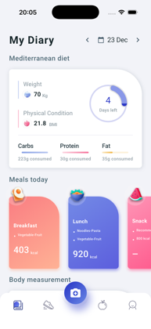](./image/Simulator Screenshot - iPhone 17 Pro - 2025-12-23 at 20.05.22.png) | [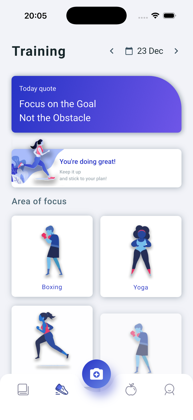](./image/Simulator Screenshot - iPhone 17 Pro - 2025-12-23 at 20.05.30.png) | [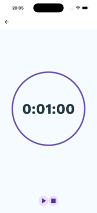](./image/Simulator Screenshot - iPhone 17 Pro - 2025-12-23 at 20.05.45.png) |

| 04 |  |  |
|---:|---:|---:|
| [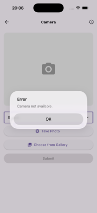](./image/Simulator Screenshot - iPhone 17 Pro - 2025-12-23 at 20.06.10.png) |  |  |

### Design notes
- Visual hierarchy: clear separation between daily metrics and action buttons to reduce cognitive load.
- Camera-first meal logging: captures an image, sends to the AI service, and displays nutrition results inline.
- Accessible colors and large touch targets for quick interactions during daily tracking.

If you prefer different images or lower-resolution thumbnails for the README, I can (a) resize and add thumbnails under `image/` and update links, or (b) generate a single combined hero image. Which option do you prefer?

### 📸 Expanded gallery (ordered)

Below is a larger set of screenshots and sample food images to help reviewers, designers, or QA understand flows and AI results.

#### App screens (iOS simulator)

| 01 | 02 | 03 |
|---:|---:|---:|
| [](./image/Simulator Screenshot - iPhone 17 Pro - 2025-12-23 at 20.05.22.png) | [](./image/Simulator Screenshot - iPhone 17 Pro - 2025-12-23 at 20.05.30.png) | [](./image/Simulator Screenshot - iPhone 17 Pro - 2025-12-23 at 20.05.45.png) |

| 04 | 05 | 06 |
|---:|---:|---:|
| [](./image/Simulator Screenshot - iPhone 17 Pro - 2025-12-23 at 20.06.10.png) | [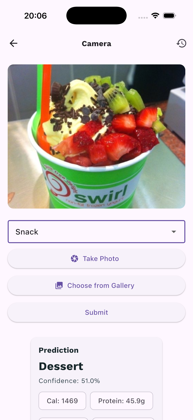](./image/Simulator Screenshot - iPhone 17 Pro - 2025-12-23 at 20.06.48.png) | [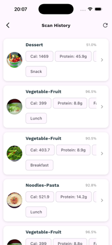](./image/Simulator Screenshot - iPhone 17 Pro - 2025-12-23 at 20.07.00.png) |

| 07 | 08 | 09 |
|---:|---:|---:|
| [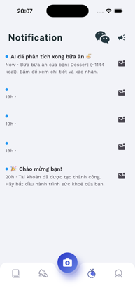](./image/Simulator Screenshot - iPhone 17 Pro - 2025-12-23 at 20.07.25.png) | [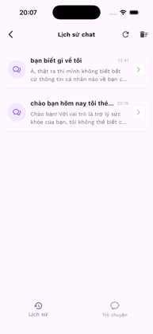](./image/Simulator Screenshot - iPhone 17 Pro - 2025-12-23 at 20.07.32.png) | [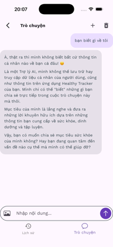](./image/Simulator Screenshot - iPhone 17 Pro - 2025-12-23 at 20.07.36.png) |

| 10 | 11 | 12 |
|---:|---:|---:|
| [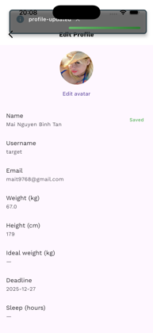](./image/Simulator Screenshot - iPhone 17 Pro - 2025-12-23 at 20.08.47.png) | [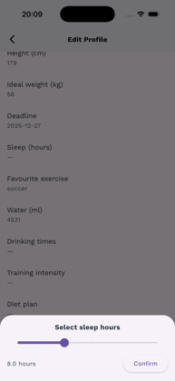](./image/Simulator Screenshot - iPhone 17 Pro - 2025-12-23 at 20.09.19.png) | [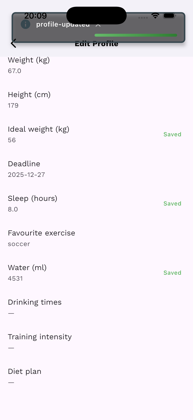](./image/Simulator Screenshot - iPhone 17 Pro - 2025-12-23 at 20.09.26.png) |

| 13 | 14 | 15 |
|---:|---:|---:|
| [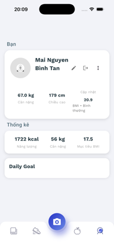](./image/Simulator Screenshot - iPhone 17 Pro - 2025-12-23 at 20.09.50.png) | [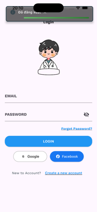](./image/Simulator Screenshot - iPhone 17 Pro - 2025-12-23 at 20.10.00.png) | [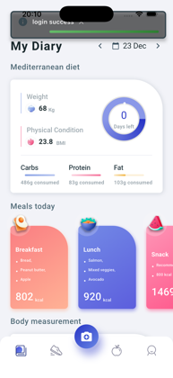](./image/Simulator Screenshot - iPhone 17 Pro - 2025-12-23 at 20.10.20.png) |

| 16 |  |  |
|---:|---:|---:|
| [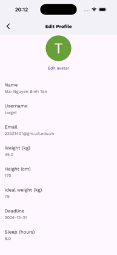](./image/Simulator Screenshot - iPhone 17 Pro - 2025-12-23 at 20.12.56.png) |  |  |

#### Sample food images (model inputs)

These images come from the `image/` folder and represent sample inputs for the AI model.

| 01 | 02 | 03 |
|---:|---:|---:|
| [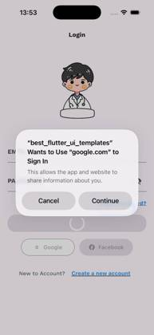](./image/0530df4c0e52810cd84320.jpg) | [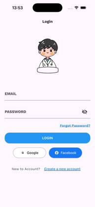](./image/092adb500a4e8510dc5f17.jpg) | [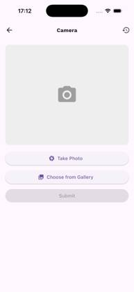](./image/1f09e670376eb830e17f12.jpg) |

| 04 | 05 | 06 |
|---:|---:|---:|
| [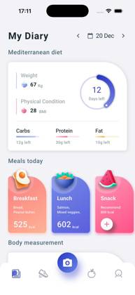](./image/318755f984e70bb952f65.jpg) | [](./image/37681c14cd0a42541b1b13.jpg) | [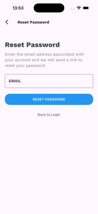](./image/3b174e6d9f73102d496219.jpg) |

| 07 | 08 | 09 |
|---:|---:|---:|
| [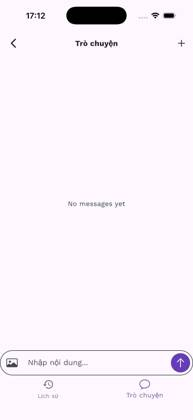](./image/509f63e4b2fa3da464eb3.jpg) | [](./image/5377b80a6914e64abf057.jpg) | [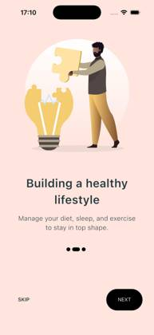](./image/5f043979e86767393e769.jpg) |

| 10 | 11 | 12 |
|---:|---:|---:|
| [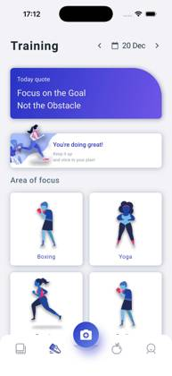](./image/63b54bcb9ad5158b4cc415.jpg) | [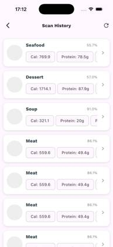](./image/64dbf2a423baace4f5ab16.jpg) | [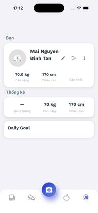](./image/80dbbaa16bbfe4e1bdae4.jpg) |

| 13 | 14 | 15 |
|---:|---:|---:|
| [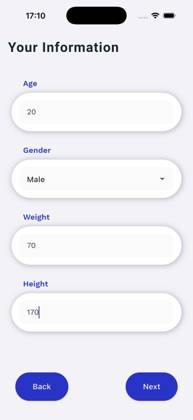](./image/8474100fc1114e4f170011.jpg) | [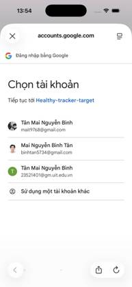](./image/96b50fcaded4518a08c521.jpg) | [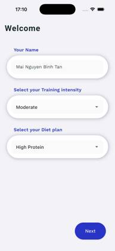](./image/9f6bd211030f8c51d51e1.jpg) |

| 16 | 17 | 18 |
|---:|---:|---:|
| [](./image/9ff1228df3937ccd258210.jpg) | [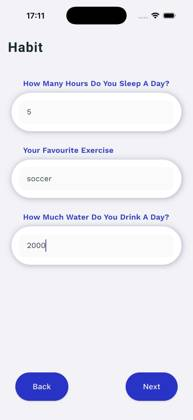](./image/d0ea80975189ded7879814.jpg) | [](./image/dc8e56f587eb08b551fa8.jpg) |

| 19 | 20 | 21 |
|---:|---:|---:|
| [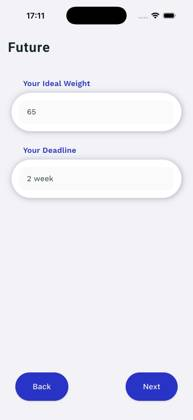](./image/e7aeb4d565cbea95b3da6.jpg) | [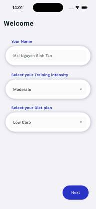](./image/e7f1288bf99576cb2f8422.jpg) | [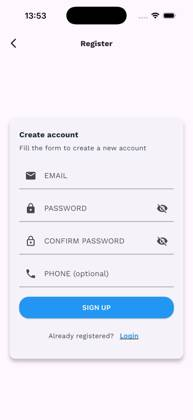](./image/ee7a3900e81e67403e0f18.jpg) |

| 22 |  |  |
|---:|---:|---:|
| [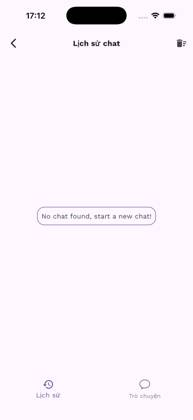](./image/f553572b8635096b50242.jpg) |  |  |

#### Captions / bilingual notes
- Dashboard: Tổng quan hàng ngày — calories, nước, hoạt động. (Daily overview)
- Meal logging: Chụp ảnh → Gửi đến AI → Trả về nhãn dinh dưỡng. (Capture → AI inference → Nutrition labels)
- Reminders: Lập lịch nhắc uống nước và bữa ăn. (Scheduled hydration & meal reminders)


