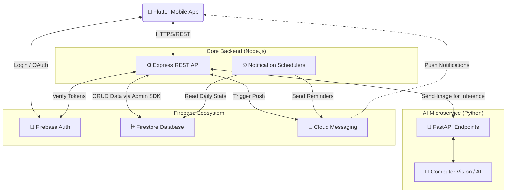

# 🩺 Health Tracker App

A full-stack Health Tracker application that helps users record daily health metrics and build sustainable habits. The project combines a **Flutter** mobile client, a **Node.js** backend, an **AI microservice** (FastAPI), and **Firebase** for authentication and data storage. It is a **work-in-progress portfolio project with deployment configuration, not a production-ready system** - see [Status and known gaps](#-status-and-known-gaps) below for what actually works and what does not.

## 📍 Status and known gaps

This section records what has actually been verified, so the rest of this README
is not read as a description of a running system.

**Verified on 2026-09-26**

- `cd backend && npm test` -> `Tests: 1 skipped, 30 passed, 31 total`.
- `backend/test/seed.integration.test.js` is **skipped**, not passed, unless the
  Firestore emulator is running. It previously returned early and was reported as a
  PASS, which inflated the count.
- The backend **cannot start without configuration**. `backend/src/index.js` refuses
  to boot unless `FIREBASE_API_KEY`, `GOOGLE_CLIENT_ID`, `FACEBOOK_APP_ID`,
  `FACEBOOK_APP_SECRET`, `JWT_SECRET`, `JWT_REFRESH_SECRET`, `AI_SERVICE_URL` and
  `AI_CHAT_API_KEY` are all set. Verified by importing `src/index.js` with an empty
  environment.

**Known gaps**

- **No CI runs on GitHub.** The only pipeline definition is `.gitlab-ci.yml`; this
  repository has no `.github/` directory, so nothing executes on a GitHub push or
  pull request.
- **`.gitlab-ci.yml` has never been proven green.** Two jobs reference things that
  do not exist: `security-dast` curls `http://localhost:5001/api/v1/health`, but the
  app serves its health check at `GET /api/health` (`backend/src/index.js:123`) and
  mounts no `/api/v1` prefix; `deploy-monitoring` applies
  `k8s/monitoring/prometheus.yaml` and `k8s/monitoring/grafana.yaml`, and there is
  no `k8s/monitoring/` directory.
- **Most passing tests do not exercise the application.**
  `backend/test/auth.integration.test.js` builds a mock Express app inside the test
  file and asserts against that mock, not against `src/`.
- **The Flutter client has not been built.** Flutter and Dart are not installed on
  the machine used for this assessment, so `flutter build` and `flutter test` were
  **NOT VERIFIED** and no Flutter/Dart toolchain was installed to find out.

### Repository size

GitHub reports this repository at roughly **271 MB**, while the working tree is only
about **23 MiB**. The difference is git-history bloat: large binaries (model weights,
build output, dependency trees) were committed at some point and later deleted from
`HEAD`, so they still exist in history.

This was **not** cleaned up here. Removing it requires rewriting history with
`git filter-repo` (or `git lfs migrate`), which changes every commit SHA and forces
a coordinated re-clone or force-push for anyone who has a copy. That is a
destructive, owner-level decision, so it is left to the repository owner as a
separate, deliberate step. The working tree is now clean of the orphan artifacts
that were reachable from `HEAD` (see `.gitignore`).

---

## ✨ Highlights

- 🧭 **User-centric tracking**: Calories, water, meals, and other daily health metrics.
- 🧠 **AI-assisted food analysis**: Automatic nutrition calculation via custom image recognition models.
- ⏰ **Smart notifications**: Automated reminders for meals, hydration, workouts, and daily summaries.
- 🔐 **Secure Auth**: Authentication via Google, Facebook, and Firebase Auth.
- 📱 **Mobile-first UX**: Smooth, intuitive interface built with Flutter.
- 🚀 **Deployment config, not deployment**: a GitLab CI definition, a Dockerfile and Kubernetes manifests are present. None of them is proven to run - see [Status and known gaps](#-status-and-known-gaps).

---

## 🏛️ System Architecture

The application is built on a modern microservices architecture separating the client, backend logic, and heavy AI inference tasks.


```mermaid
graph TD
    %% Components
    Client(📱 Flutter Mobile App)
    
    subgraph "Core Backend (Node.js)"
        API[⚙️ Express REST API]
        Cron[⏰ Notification Schedulers]
    end
    
    subgraph "AI Microservice (Python)"
        FastAPI[🤖 FastAPI Endpoints]
        Model[🧠 Computer Vision / AI]
        FastAPI <--> Model
    end
    
    subgraph "Firebase Ecosystem"
        Auth[🔐 Firebase Auth]
        Firestore[🗄️ Firestore Database]
        FCM[📲 Cloud Messaging]
    end

    %% Interactions
    Client <-->|HTTPS/REST| API
    Client <-->|Login / OAuth| Auth
    
    API <-->|CRUD Data via Admin SDK| Firestore
    API <-->|Verify Tokens| Auth
    API <-->|Trigger Push| FCM
    API <-->|Send Image for Inference| FastAPI
    
    Cron -->|Read Daily Stats| Firestore
    Cron -->|Send Reminders| FCM
    FCM -.->|Push Notifications| Client
```

---

## 🧰 Tech Stack

- **Frontend:** Flutter & Dart
- **Backend:** Node.js, Express.js
- **Database & Auth:** Firebase Firestore, Firebase Authentication, FCM
- **AI Service:** Python 3.11, FastAPI, Uvicorn, Custom ML Models
- **DevOps:** Docker, GitLab CI/CD, SonarQube, Semgrep, Kubernetes, ArgoCD

---

## ⚡ Quickstart (Local Development)

### 1. Firebase Emulator
Start the local Firebase emulator (Auth + Firestore):
```bash
firebase emulators:start --only auth,firestore
```

### 2. Backend (Node.js)
Copy the environment template and start the backend:
```bash
cd backend
cp .env.example .env
npm install
npm run dev
```
> The backend defaults to `http://localhost:5001`.

### 3. AI Service (FastAPI)
Create a Python 3.11 virtual environment and start the AI engine:
```bash
cd AI
python3.11 -m venv .venv
source .venv/bin/activate
pip install -r requirements.txt
python -m uvicorn main:app --host 0.0.0.0 --port 8000 --reload
```
> The AI service is available at `http://localhost:8000`.

### 4. Flutter App
Run the app and point it to the local backend API:
```bash
cd frontend
flutter run -d <DEVICE_ID> --dart-define=BASE_API_URL=http://127.0.0.1:5001
```

---

## 🛡️ Security & Authentication

- **Firebase Admin SDK:** Generate a private key from Firebase Console and save it to `backend/secrets/firebase-adminsdk.json`.
- Do **not** commit `.env` or the `secrets/` directory to source control.
- Ensure production secrets are managed securely via CI/CD variables or Kubernetes Secrets.

---

## 🚢 CI/CD & Deployments

This project contains pipeline definitions (`.gitlab-ci.yml`) and Kubernetes manifests for automated deployment:
- **Testing & Quality:** Semgrep (SAST), SonarQube, Zap (DAST).
- **Build & Package:** Automated Docker image builds for Backend and AI services pushed to Harbor Registry.
- **GitOps Deployment:** Kustomize manifest updates and automatic synchronization via ArgoCD.

---

## 🎨 Design & Screenshots

Below are selected screens illustrating the mobile UX.

| 01 - Hero | 02 - Dashboard | 03 - Meal Logging |
| :---: | :---: | :---: |
| [](./image/Simulator%20Screenshot%20-%20iPhone%2017%20Pro%20-%202025-12-23%20at%2020.05.22.png) | [](./image/Simulator%20Screenshot%20-%20iPhone%2017%20Pro%20-%202025-12-23%20at%2020.05.30.png) | [](./image/Simulator%20Screenshot%20-%20iPhone%2017%20Pro%20-%202025-12-23%20at%2020.05.45.png) |

| 04 - Reminders | 05 - Analytics | 06 - Profile |
| :---: | :---: | :---: |
| [](./image/Simulator%20Screenshot%20-%20iPhone%2017%20Pro%20-%202025-12-23%20at%2020.06.10.png) | [](./image/Simulator%20Screenshot%20-%20iPhone%2017%20Pro%20-%202025-12-23%20at%2020.06.48.png) | [](./image/Simulator%20Screenshot%20-%20iPhone%2017%20Pro%20-%202025-12-23%20at%2020.07.00.png) |

> *Note: More screenshots and sample AI food recognition inputs are available in the `image/` directory.*

---

## 🗺️ Roadmap

- [ ] Health analytics dashboard & deep insights.
- [ ] AI-powered advanced meal recommendations.
- [ ] Enhanced push notification flows with personalized routines.
- [ ] Advanced monitoring & observability (Prometheus, Grafana integration).

---

## 👤 Authors

- **Mai Nguyễn Bình Tân** — Software Engineering, AI & DevOps
